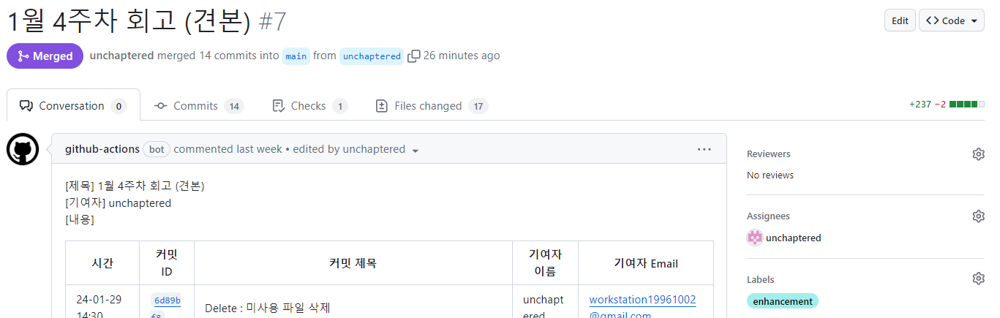
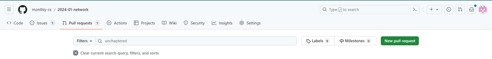
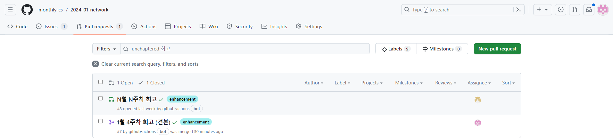

# IT 엔지니어를 위한 네트워크 입문 스터디

월간 CS는 **매일 책을 읽는 팀**입니다.

하루 한 장이라도 책을 읽고 인증샷과 DIL을 작성해서 올려주세요.

- 책 : IT 엔지니어를 위한 네트워크 입문
- 기간 : 2024-01 ~

<image src="./images/book_cover.jpg"
        style="width: 200px; margin-left: 22px;">

## 1. Contributior

| Name | Contact |
| ---- | ------- |
| [@unchaptered](https://github.com/unchaptered) | workstation19961002@gmail.com |
| [@playhuck](https://github.com/playhuck) | wngur89@gmail.com |
| [@smilejakdu](https://github.com/smilejakdu) | |
| [@aksmf1442](https://github.com/aksmf1442) | |
| [@brightchul](https://github.com/brightchul) | |
| [limsangkyu0219]() | |
| [limseongdev]() | |
| [@jiwon615](https://github.com/jiwon615) | |
| [@sonmansu](https://github.com/sonmansu) | |
| [@refresh88](https://github.com/refresh88) | |
| [@kafkaaaa](https://github.com/kafkaaaa) | |
| [@minenam](https://github.com/minenam) | |
| [@jaeeunlee322](https://github.com/jaeeunlee322) |  |

## 2. Group Rule

깔끔하게 정리해두면 `나와 동료들의 회고`를 볼떄도 편할 것 같습니다.

이에 편의를 위한 몇 가지 간단한 룰이 있어요!

- [2.a. 각자 branch 만들기](./README.md#2a-각자-branch-만들기-😊)
- [2.b. PR 병합 전에 제목 변경하기](./README.md#2b-pr-병합-전에-제목-변경하기-😊)

### 2.a. 각자 branch 만들기 😊

1. 각자 main branch에서 분기해서 <개인 branch>를 만들어주세요!
2. docs/ 경로에 <개인 branch 명>에 맞는 폴더를 만들어주세요.
        - docs/unchaptered 등과 같이
3. 파일명은 YYYY-MM-DD 형태로 작성하시되, 나머지는 개인이 편하게 작성해주시면 됩니다!
        - docs/unchaptered/2024-02-01_회고

### 2.b. PR 병합 전에 제목 변경하기 😊

PR은 N월 N주차에 형태에 맞춰서 작성해주세요!

만약 본인이 작성한 회고를 보고 싶으시면 Filter 탭에 개인 이름을 입력 해주시면 됩니다!

## 3. Recommendation

책을 읽고 공부한느 방법이 있다면, 그 방법으로 읽으면 될 것 같습니다.

하지만, 아래에 해당하는 분이라면 처음에는 `편하게 1회독 하는 마음`으로 읽는 것을 추천드립니다.

1. 이 책을 아예 처음 읽는 분
2. CS, 네트워크 공부가 처음인 분
3. 혹은 내용이 조금 어렵다고 느껴지는 분

책을 읽으시면서 나에게 필요한 내용이라고 생각이 든다면 그 부분만 검색을 하면서 더 살펴보면 좋을 것 같습니다.

그리고 이해가 너무 안되는 부분이 있다면, GitHub Issue에 남겨주세요!

        