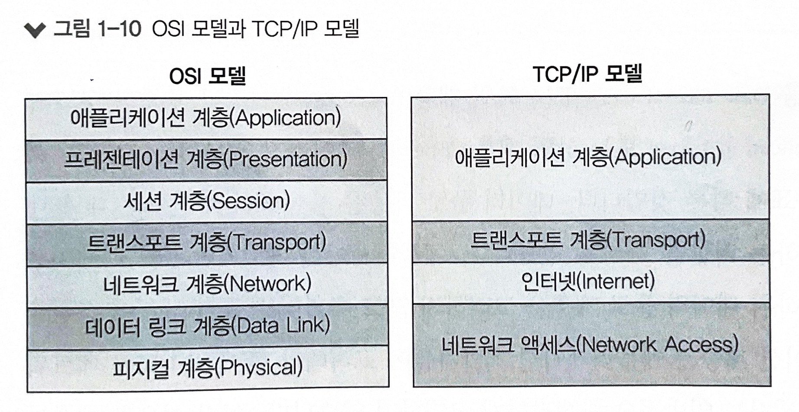

### 1.3.2 TCP/IP 프로토콜 스택

-   TCP/IP 프로토콜 스택은 이론 보단 실용성에 중점을 둔 프로토콜임.
-   OSI 모델은 7 계층인 반면 TCP/IP 프로토콜 스택은 4 계층으로 나뉨.
-   OSI 7 계층 모델은 크게 상부/하부 계층으로 나뉜다고 했음.
    1. 데이터 플로 계층 (1-4계층): 데이터를 잘 전달하는데에 초점
    2. 애플리케이션 계층 (5-8계층): 데이터를 만드는 부분  
       => 애플리케이션 개발자 & 네트워크 엔지니어가 고려해야 할 부분이 구분돼있었는데, TCP/IP 모델에선 더 확연히 드러남
       : TCP/IP 프로토콜 스택은 OSI 7계층의 상위 3개 계층을 하나의 애플리케이션 계층으로 묶고, 1,2 계층을 하나의 네트워크 계층으로 구분함

