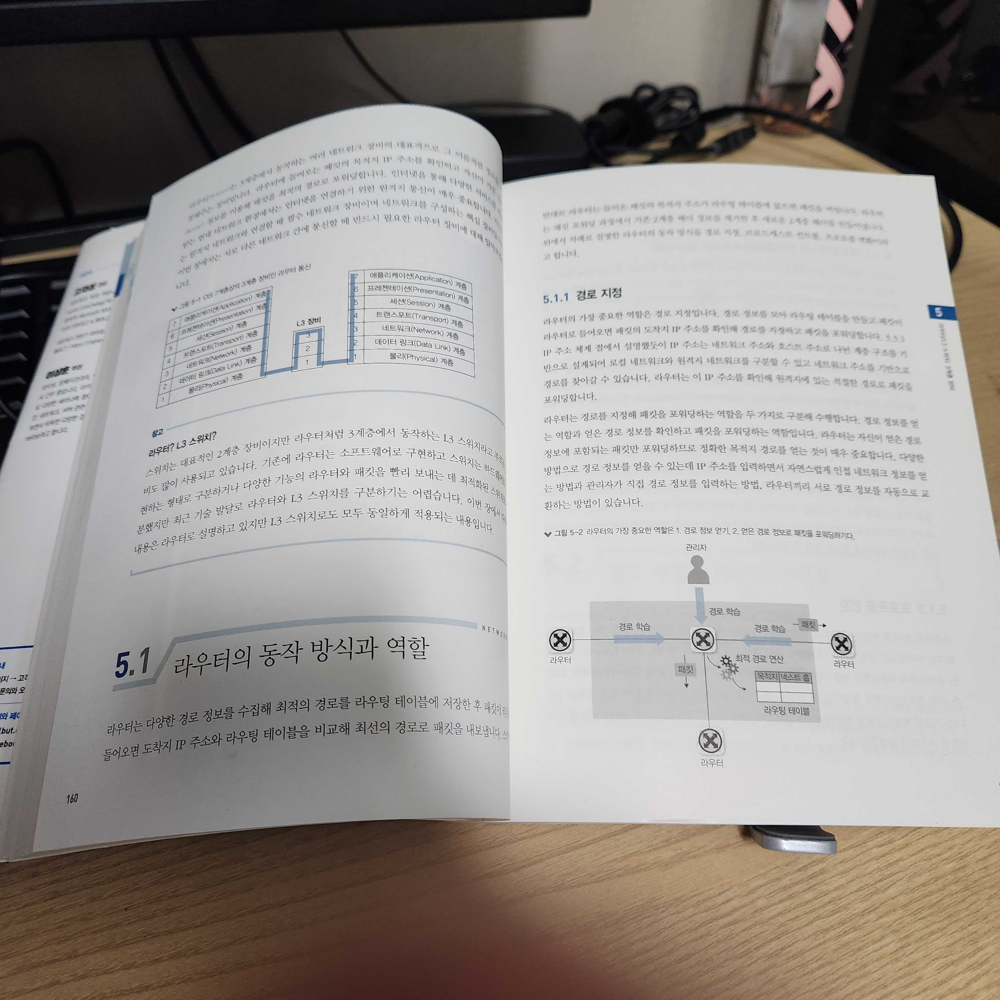

**[5장] 라우터 L3 스위치 3계층 장비**에 대해서 배웠다.

| playhuck님이랑 매일 점심에 조용한 회의실에서 읽고 있다. 하지만 오늘은 조금 이슈가 있어서 각자 집에가서 읽기로 하였다. 모르는 내용을 다 찾아보면 `절대로` 완독을 못할 거라고 생각해서 빠르게 1회독 하려는 전략이 나쁘지 않은 것 같다.

4, 5장 모두 `스위치`라는 말이 나와서 처음에 조금 혼란스러웠다.

이 부분은 `0계층 장비`에 집중해 곰곰히 생각해보니 이해가 편했다.

2계층(Data Link Layer)에서 배운 점은 MAC Address와 관련된 네트워크 통신을 주체하는 장비인 `스위치`에 대해서 배웠다.

그렇다면 3계층(Network Layer)는 IP Address와 관련된 네트워트 통신과 관련된 내용일 것입니다.

| _최근에 서비스 전체를 Terraform으로 배포하면서 Route Table, Route, Route Table Association 등을 코드 레벨에서 정의한 경험이 있어서, 조금이나마 따라갈 수 있었습니다._

 

3계층에서 중요한 요소는 `라우터`이며, 다음과 같은 역할을 합니다.

1. 경로 지정
2. Broadcast Control, Multicast Control -> 이 내용은 [3장] 네트워크 통신하기 73~74p에 나왔습니다.
3. 프로토콜 변환

 

그 중에서도 **104p 5.2.1. 라우팅 동작과 라우팅 테이블** 부분을 일곡 나니 기존에 Rout Table, Route, Route Table Association이 진짜 무식한 방식(비효율적인) 방식으로 작동하고 있을 것 같다는 느낌이 들었다.

그냥 RTB 1개에 IGW 1개 딱, 다른 RTB 1개에 NAT 1개 딱 깔았기 떄문에 SPoF 상태가 된 것 같다.

 

그래도 유익한 부분은 기본적으로 Route는 Next Hob이라는 방식으로 연동이 되어 있다는 부분이었습니다.

지금까지는 Public Subnet에 IGW와 나머지는 전부 암묵적으로 찾아가도록 설치해놓은 것 같습니다.

아마 성능 상 개선을 하기 위해서라면 여러 개의 Router를 두고 직접적으로 Direct Connected 혹은 Static Routing 방식으로 변경하는 것이 좋아보였습니다.

이 부분은 별도로 AWS 환경에서 실습하는 것이 좋아보입니다.

 

지금까지 말한 부분이 라우터의 `라우팅` 부분이었습니다.

또 색다른 부분은 `스위칭`이라는 부분이었는데, 라우터가 경로를 지정하는 방법에 대해서 였습니다.

다만 이 부분은 제대로 이해할 수 없었고 2회독이나 Network Traffic Trace 혹은 Wireshark로 패킷 뜯어보면서 보면 조금 더 이해가 잘 되지 않을까? 란 생각이었습니다.

 

남은 부분...

1. 스위칭이 먼저 된다.
2. 라우팅은 관리 거리(AD), 코스트(비용 계산은 또 수많은 알고리즘이...), 부하 분산(ECMP; 역시 수많은 알고리즘이...)

 

전체적으로 [4장] [5장]을 보면서 느낀 건데, 하위 계층으로 내려갈수록 생소한 것 같습니다.

아마도 7계층에서 로드 밸런서를 위주로 실습 혹은 업무를 진행해서 그런 것 같습니다.

| 하지만 2계층, 3계층 실습은 대체 어떻게...?

| 그나마 4계층 NLB(Network Load Balancer)는 어떻게 해야 하는가...

| 대부분의 지식들이 그물망처럼 연결될테니까,,, 이대로 킵 고잉 하다보면 괜찮을지도...