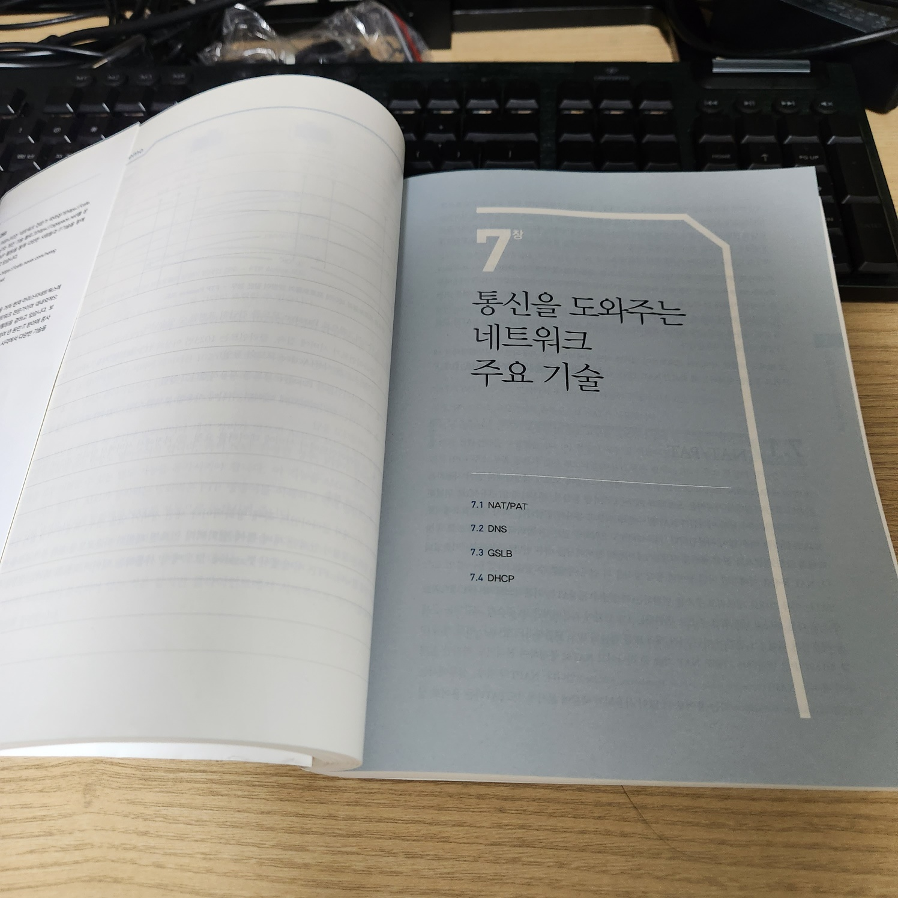

오늘은 [7장]의 일부만 읽었습니다.

실무에서 일을하면서 많이 접했던 NAT, DNS의 내용은 기존에 알고 있던 내용이었습니다.

다만 동적 NAT, 정적 NAT과 같은 생소한 내용도 일부 있었습니다.

 

PAT 이라는 네트워크 장비의 존재도 알게되었습니다.

 

요즘 다사다난한 일이 많아서 집중이 되지 않았는데, 다시 회사 점심시간에 책을 읽어야 겠습니다.

 
