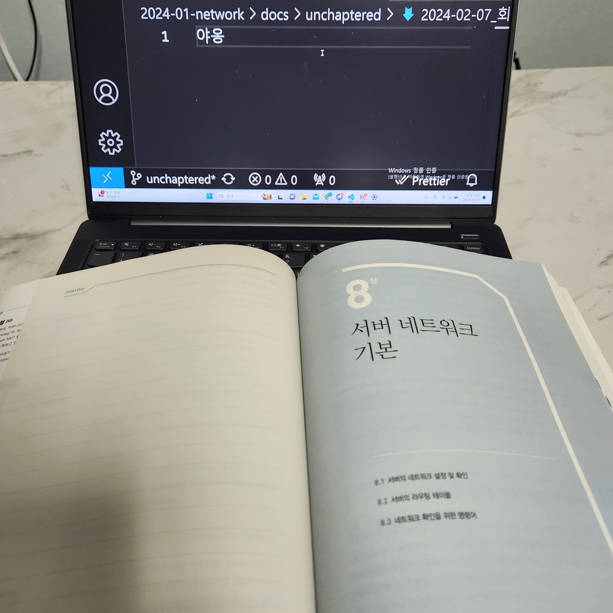
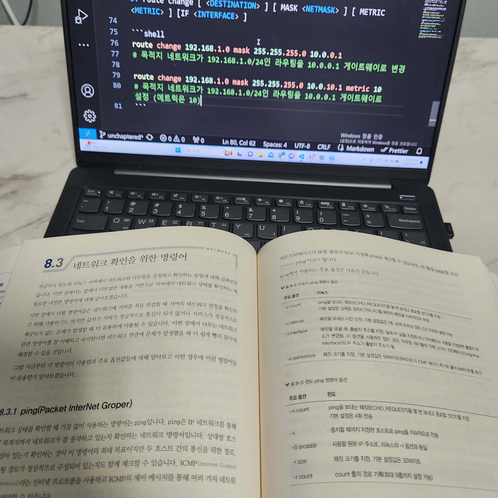
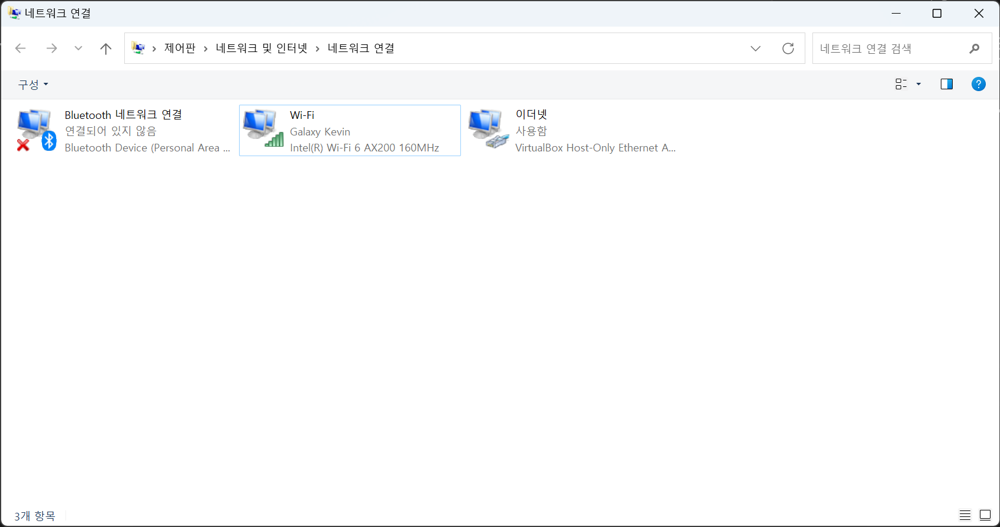
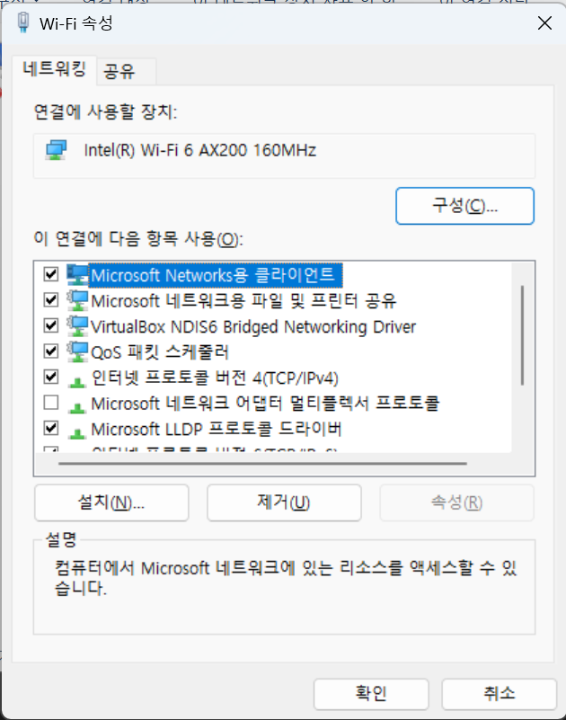

[어제](./2024-02-06_회고_[8장]%20서버%20네트워크%20기본.md) 책을 진짜 3분 정도 밖에 읽지 않았습니다.

제대로 읽지 않아서, 어제 읽은 부분을 포함해서 다시 읽었습니다.

 
 
 
 

네트워크 설정을 보고 연결 장비 설정을 할 수 있는 부분이 나왔습니다.

1. `ncpa.cpl`를 통해서 [네트워크 연결 현황]을 볼 수 있다.
    1. 개별 네트워크 리스트를 볼 수 있다.
        <br>
         
    2. 개별 네트워크 리스트에서 속성(Alt + Enter)을 눌러서 `연결에 사용 된 항목`을 볼 수 있다.
        <br>
        
    3. [고급] 탭에서 세부적인 설정이 가능하며, 네트워크 어뎁터가 2개 이상이면 수동 설정이 필요할 수 있다.
2. `ipconfig`를 통해서 네트워크 설정값을 알 수 있다.
3. `ipconfig /all` 옵션을 사용해서 확인할 수 있다.
 
전체적으로 네트워크 어뎁터 설정을 위한 명령어들도 추가로 알려줬습니다.

주로 `netsh` 명령어 들이었는데, 이런거 입력했다가 컴퓨터 망가지면 어떻게하지? 이런 생각이 조금 들었습니다.

```shell
# 설정
netsh interface ip4 set address name="<INTERFACE_NAME>" source=dhcp
netsh interface ipv4 set dns name="<INTERFACE_NAME>" static <DNS_SERVER_ADDRESS> index=2
netsh interface ipv4 set dns name="<INTERFACE_NAME>" source=dhcp

# 어뎁터 리셋
netsh interface set interface name="<INTERFACE_NAME>" admin=disabled

# 어뎁터 활성화
netsh interface set interface name="<INTERFCAE_NAME>" admin=enabled
```

이 다음에는 313, 314p의 서버 라우팅 테이블 항목이 재밌었습니다.

AWS VPC에서 설정하고 있는 항목들에 대한 부분이 흥미로웠습니다.

```shell
10.10.020.0   24       10.10.10.1 eht1        10
<Destination> <Subnet> <Gateway>  <Interface> <Priority>
```

1. `route`명령어는 print, add, delete, change 옵션을 쓸 수 있다.
2. `route print`로 설정되어 있는 라우팅 테이블 정보를 볼 수 있다.
3. route [ -p | ADD | dest ] [mask <NET_MASK> ] [ <GATEWAY> ] [ METRIC <METRIC> ] [ IF <INTERFACE> ]

```shell
route add 192.168.1.0 mask 255.255.255.0 10.0.0.1
# 192.168.1.0/24에 대해 10.0.0.1으로 라우팅

route add 192.168.1.0 mask 255.255.255.0 10.0.0.1 metric 100
# 192.169.1.0/24에 대해 10.0.0.1으로 라우팅 (메트릭은 100)

route add -p 172.16.0.0 mask 255.255.240.0 10.0.0.1
# 목적지 172.16.0.0/12에 대해 10.0.0.1으로 라우팅 (영구 경로 등록)
```

4. route delete [ <DESTINATION> ] [ mask [NET_MASK] ] [ <GAETWAY> ] [ METRIC <METRIC> ] [ IF <INTERFACE >]

```shell
route delete 192.168.1.0 mask 255.255.255.0 10.0.0.1
# 목적지 192.168.1.0/24에서 10.0.0.1으로 가는 라우팅 삭제

route delete 192.168.1.0 mask 255.255.255.0
# 목적지 192.168.1.0/24의 모든 라우팅 삭제

route delete 192.16.1.0
# 목적지 네트워크가 192.16.1.0인 모든 라우팅 삭제
```

5. route change [ <DESTINATION> ] [ MASK <NETMASK> ] [ METRIC <METRIC> ] [IF <INTERFACE> ]

```shell
route change 192.168.1.0 mask 255.255.255.0 10.0.0.1
# 목적지 네트워크가 192.168.1.0/24인 라우팅을 10.0.0.1 게이트웨이로 변경

route change 192.168.1.0 mask 255.255.255.0 10.0.10.1 metric 10
# 목적지 네트워크가 192.168.1.0/24인 라우팅을 10.0.0.1 게이트웨이로 설정 (메트릭은 10)
```