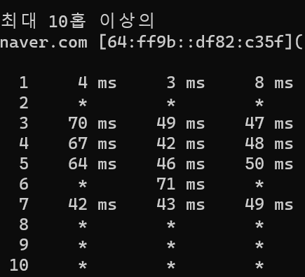

[그제](./2024-02-06_회고_[8장]%20서버%20네트워크%20기본.md)와 [어제](./2024-02-07_회고_[8장]%20서버%20네트워크%20기본%202회차.md)에 이어서 **8장**을 읽었습니다.

8장에서 그제와 어제 읽은 내용은 다음과 같습니다.

1. 서버의 네트워크 설정 및 확인
2. 서버의 라우팅 설정

오늘은 네트워크 확인을 위한 명령어를 읽었습니다.

 
 
 
 

### ping

- `ping`은 IP 네트워크를 통해 특정 목적지까지 네트워크가 잘 동작하고 있는지 확인하는 네트워크 명령어입니다.
- `ping`은 상대방 네트워크가 살아있는지 확인하는 것이 최대 목표입니다.
- `ping`으로 두 호스트 간의 통신을 위한 경로, 즉 라우팅 경로가 정상적으로 구성되어있는지 확인할 수 있습니다.
- `ping`은 ICMP(Internet Control Message Protocol)이라는 인터넷 프로토콜을 사용하고 ICMP의 제어 메세지를 ㅗㅌㅇ해 여러 가지 네트워크 상태를 파악할 수 있습니다.

```shell
ping <OPTION> DESTINATION_IP_ADDRESS
```

- Linux

```shell
-c  count       ping을 몇 번 보낼지 설정, 기본값은 Ctrl+C를 누르는 시점까지 반복
-i  interval    packet 간의 간격을 설정, 기본값은 1초, 슈퍼 유저는 0.2초 이하로 설정 가능
-I  interface   packet을 보낼 때, 출발지 주소를 지정, 기본값은 라우팅 테이블에 의해 나가는 인터페이스(Outgoing-Interface)의 IP Address를 사용
-s  packetsize  packet 크기를 지정, 기본값은 56 바이트 + 8 바이트의 ICMP 헤더가 붙어서, 64 바이트
```

- Window

```shell
-n  count       ping을 몇 번 보낼지 설정, 기본값은 4회
-t              중지할 떄까지 지정한 호스트로 ping을 지속 전송
-S  srcaddr     사용할 원본 IP 주소, 리눅스의 -l 명령어와 동일
-l  size        packet 크리를 지정, 기본값은 32바이트
-r  count       count 홉의 경로 기록(최대 9홉까지 기록)
```

> 여기서 홉이란 라우팅 테이블을 지날 때마다 1개씩 줄어듭니다.

이를 통해서 아래와 같이 ping을 보내는 예제가 구성됩니다.

```shell
ping 8.8.8.8 -c 2 -s 100
```

### tcping (Window)

> 앞서 읽은 ping으로는 실제 서비스와 같은 방식의 테스트가 불가능합니다. 따라서 TCP/UDP 프로토콜과 포트번호까지 지정한 요청을 보내려면 `tcping` 혹은 `telnet`으로 확인할 수 있습니다.

> 책에서는 tcping을 사용하라고 되어 있었는데, 저는 별도로 설치가 필요했습니다.
> 
> chocolatey라는 패키지 관리매니저를 통해서 편하게 설치가 가능합니다.
>
> `choco install tcping`

```shell
tcping <OPTION> DESTINATION_IP_ADDRESS
```

- <OPTION\>


```shell
-n  count       tcping 반복 횟수
-t              Ctrl+C로 중지할 떄까지 반복
-i  interval    tcping 반복 간격
serverport      tcping으로 확인하려는 서비스 포트, 기본값은 HTTP(80)
```

- 예제

```shell
tcping naver.com

# Probing 126.209.222.141:80/tcp - Port is open - time=16.907ms
```

### traceroute(linux)/tracert(window)

- `traceroute/tracert`는 출발지부터 통신하거나, 목적지까지 네트워크 경로를 확인할 때 사용하는 네트워크 명령어입니다.
    - `ping`은 목적지 단말이 잘 동작하는데 사용되고 ICMP 메세지를 사용해 중간 경로에 문제가 있을 때, 이것을 확인할 수 있습니다.
    - 하지만 중간 중간 네트워크 장비가 아닌, 출발 PC에서 목적지까지의 라우팅 경로를 확인할 수 있고 목적지까지의 통신에 문제가 있을 때, 어느 구간부터 문제가 발생하였는지 찾아낼 수 있습니다.
    - 추가적으로 목적지까지 네트워크 응답 시간이 느린 경우, 어느 구간에서 응답 시간이 느려지는지 알아낼 수 있습니다.
- `traceroute/tracert`는 TTL을 이용하며, 1부터 1씩 증가시키면서 목적지에 도착할 떄까지 패킷을 반복적으로 전송하며 경로를 추적합니다.
- `traceroute/tracert`는 IP Header인 3계층 정보에 의한 경로 추적입니다.
- `traceroute/tracert`는 2계층 이하의 스위치 장비 추적은 불가능하며, 라우팅이 도작하는 라우터나 L3 스위치 같은 3계층 장비의 경로만 확인할 수 있습니다.
- A와 B의 두 호스트 간의 네트워크 경로에 대한 측정을 할 때, A->B 와 B->A 간의 네트워크 경로 설정이 다른 `비대칭 경로`일 가능성이 있습니다.
    - `traceroute/tracert`로 라우팅을 테스트할 때, `비대칭 경로`는 문제가 되지 않습니다.
    - `traceroute/tracert`로 세션을 테스트할 때, `디채이 경로`라면 통신이 차단되어 테스트할 수 없을 수 있습니다.
- A와 B의 두 호스트 중, 하나의 호스트의 네트워크 인터페이스가 2개 이상이라면 In/Out의 네트워크 장비가 바뀌면 `traceroute/tracert`가 실패할 수 있습니다.

구체적인 명령어는 다음과 같습니다.

```shell
traceroute <OPTION> DESTINATION_IP_ADDRESS  # Linux 
tracert <OPTION> DESTINATION_IP_ADDRESS     # Windows
```

작업용 PC가 Windows인 관계로 아래 windowㄴ 명령어만 테스트해봤습니다.

```shell
-d                  도메인이 아닌 숫자 형식으로 IP 주소를 표시, 도메인 리졸브 과정 미수행
-n  maximum_hops    대상 검색을 위한 최대 홉수
```

잘 작동해서 신기했습니다.
다만, Data LInk Layer의 MAC Address가 나오던데 이걸로 뭘 할 수 있는지는 잘 모르겠습니다. Windows 운영체제라서 ICMP를 기반으로 동작한다고 되어 있는데, 이 떄문일까요?

 


