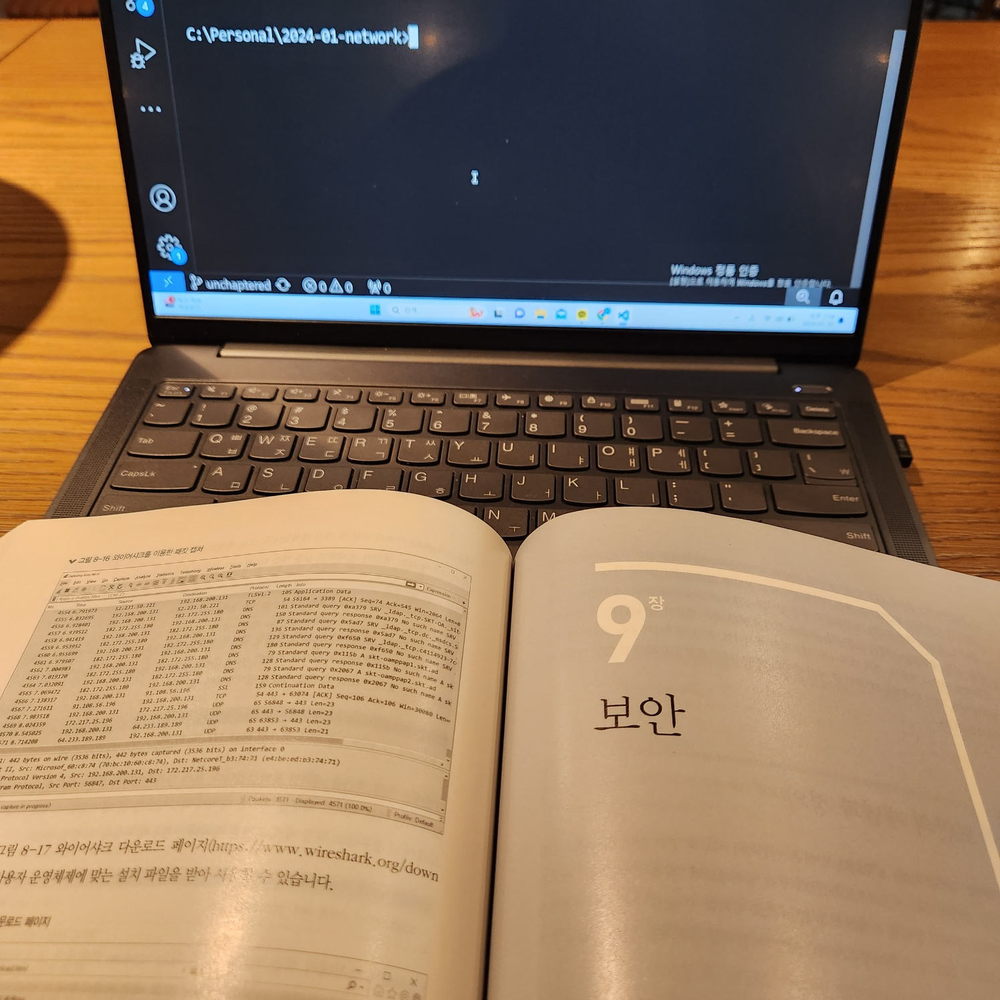
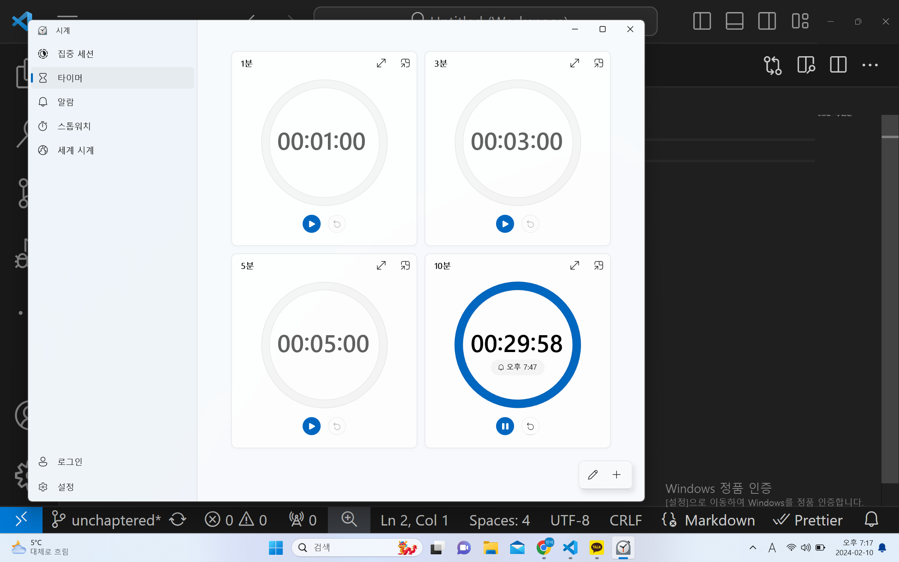
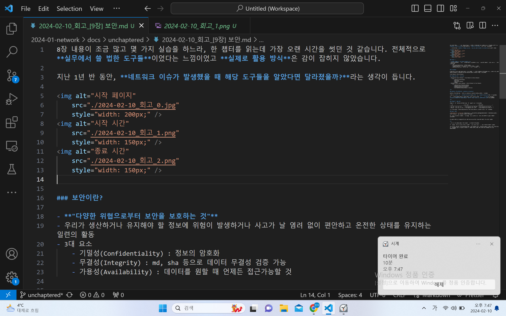
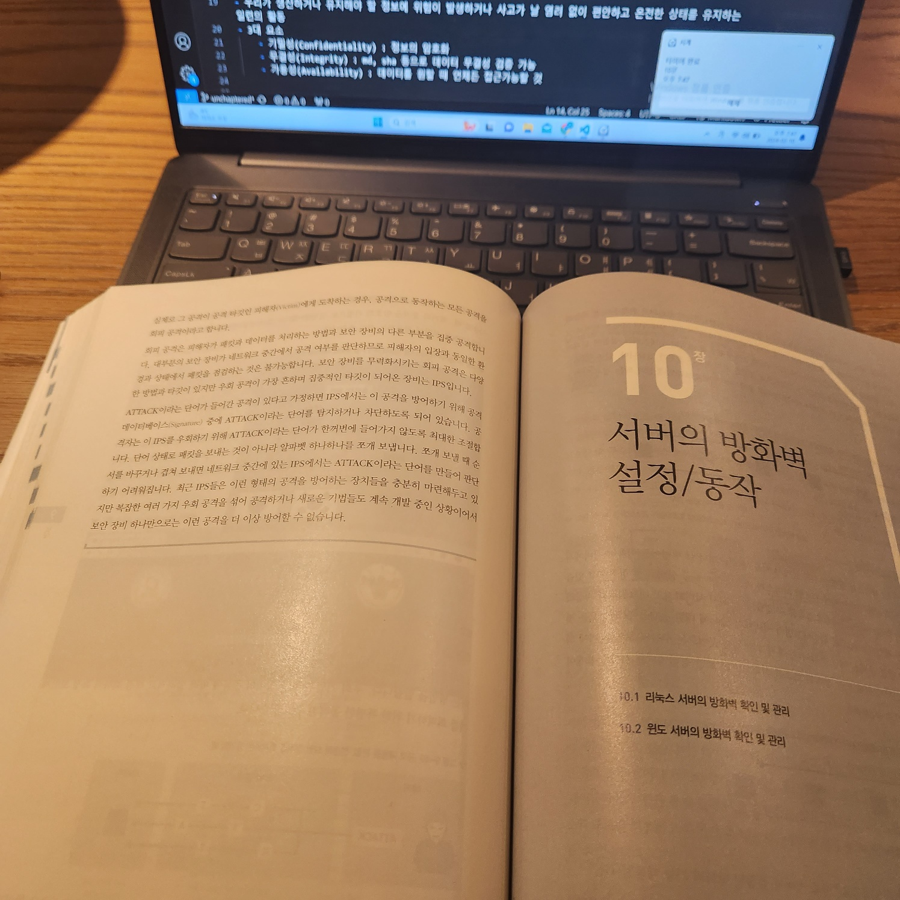

8장 내용이 조금 많고 몇 가지 실습을 하느라, 한 챕터를 읽는데 가장 오랜 시간을 썻던 것 같습니다. 전체적으로 **실무에서 쓸 법한 도구들**이었다는 느낌이었고 **실제로 활용 방식**은 감이 잡히지 않았습니다.

지난 1년 반 동안, **네트워크 이슈가 발생했을 때 해당 도구들을 알았다면 달라졌을까?**라는 생각이 듭니다.

 
 

### 보안이란?

- **"다양한 위협으로부터 보안을 보호하는 것"**
- 우리가 생산하거나 유지해야 할 정보에 위험이 발생하거나 사고가 날 염려 없이 편안하고 온전한 상태를 유지하는 일련의 활동
- 3대 요소
    - 기밀성(Confidentiality) : 정보의 암호화
    - 무결성(Integrity) : md, sha 등으로 데이터 무결성 검증 가능
    - 가용성(Availability) : 데이터를 원할 때 언제든 접근가능할 것

### TrustModel

O'REILLY의 제로트러스트 네트워크에서 읽었던 DMZ에 대한 개념이 여기에서도 나왔습니다. 다만, 여기서는 트러스트 모델(TrustModel)과 DMZ(DeMilitarized Zone)에 입각해서 설명을 이어가고 있었습니다.

Trust Network, Untrust Network

### ISG와 DCSG 그리고 그 예시들

- ISG(Internet Secure Gateway) : Trsut Network to Untrust Network
    - 예
        - SWG(Source Web Gateway)
        - Web Filter
        - Application Control
        - Sendbox
- DCSG(Data Center Secure Gateway) : Untrust Netowrk to Trust Network
    - 예
        - IPS(Intrusion Preventing System)
        - DCSG(Data Center Secure Gateway)
        - WAF(Web Application Firewall)
        - Anti-DDoS(Distributed Denial of Service)

 

### 네트워크 보안 정책 수립 : whitelist vs blacklist

네트워크 보안 정책 수립은 일반적으로 whitelist, blacklist 전략 중 하나를 선택합니다.

일반적으로 **허용한 상대만 들어오는 whiltelist**가 **특정 대상만 차단하는 blacklist**보다 많이 쓰입니다.

하지만 불특정 다수와 네트워크 통신이 필요한 경우, whitelist 정책은 **많은 관리 비용**이 들어가므로, **blacklist 기반의 방어 정책을 수립하고 데이터베이스를 주기적으로 업데이트하는 것**이 바람직합니다.

 

### IPS와 탐지 타입 4종

IPS와 같은 탐지 계열의 방어체계는 4가지 탐지 타입이 발생할 수 있습니다.

| 구분                        | 공격 상황                     | 정상 상황                     |
| --------------------------- | ---------------------------- | ---------------------------- |
| 공격 인지   공격 알림      | True Positive   정상 탐지 | False Positive   오 탐지   | 
| 정상 인지   공격 알림 없음 | True Negative   미 탐지   | False Negative   정상 탐지 |

최근 보안 벤더들은 Whitelist와 Blacklist 보안 방식을 결합해서 사용하는 것을 권고하고 있습니다.

### 자세한 설명

[ISG와 DCSG 그리고 그 예시들](./2024-02-10_회고_[9장]%20보안.md#ISG와%20DCSG%20그리고%20그%20예시들)에서 언급한 장비 중 몇 가지의 자세한 설명이 나왔습니다.

다만 업무를 진행하면서 AWS에서 관련 장비와 관련된 세미나를 들은 내용과 동일하거나 더 작아서 필기하지 않았습니다.

그 외에는 VPN이라는 장비가 나왔으나, AWS Site-to-site VPN, Client-VPN 등에서 이미 접하였습니다.

 

구체적으로 그 외에도 다양한 보안 장비에 대한 내용들이 나왔습니다.

이 부분들도 대략적으로 키워드 위주로 알아두고 관련된 업무를 진행할 때, 다시 살펴보면 좋아보였습니다.

(단 클라우드 환경에서) DevSecOps분들도 완전관리형 솔루션을 통해서 시간-비용 트레이드 오프를 하는 추세인 걸로 알고 있습니다. 따라서 더 자세한 내용을 보고 싶다면 CSP업쳬(AWS, GCP 등)의 보안 솔루션을 보는 것도 좋아보입니다.
 