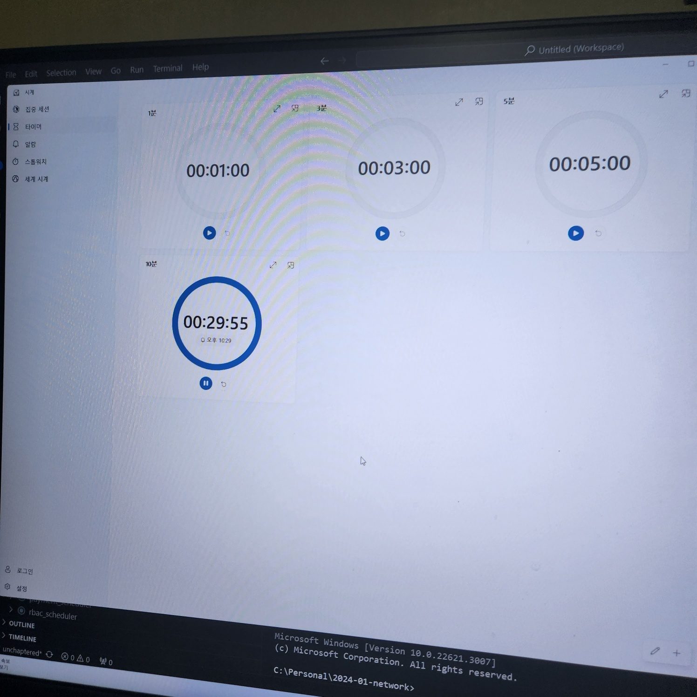
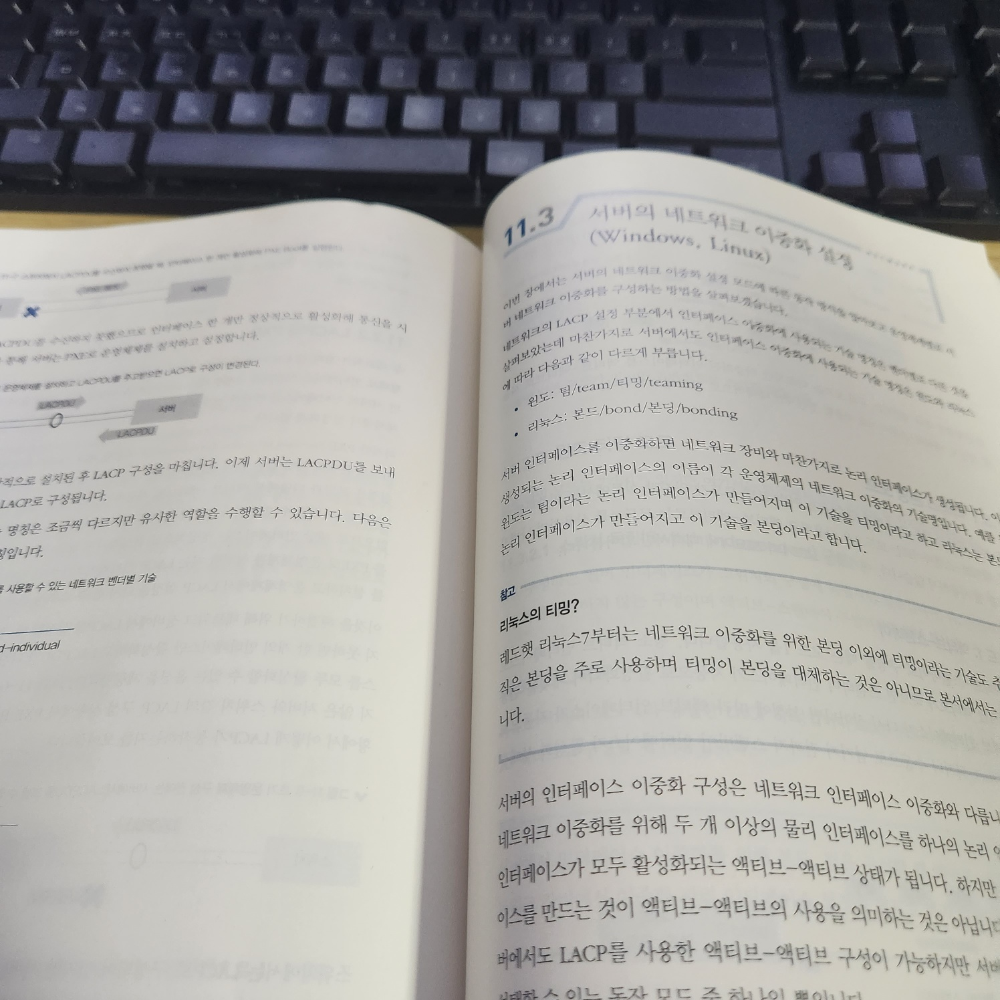

오늘은 [11장] 이중화 기술에 대해서 배웠습니다.

SPoF에 대해서 개념적으로 알고 있었는데, 조금 더 딥한 내용들이 많은 것 같아서 기대를 하고 자세히 읽었습니다.

[9장], [9장]이 CLI 스크립트가 많았지만 실제로는 어떻게 써야할 지모르겠었던 것에 반해, [11장]에서는 이론적인 내용이 많아서 좋습니다.

 
 

### SPoF

SPoF(Single Point of Failure)

- 인프라의 End-to-End 간 SPoF를 피하기 위한 이중화를 고민해야 합니다.
- 데이터 베이스 엑세스를 이중화하여, 천재지변에 대비할 수 있습니다.
- 단, 이중화를 하게 될 경우 비용이 증가하므로 이 부분도 고려해야 합니다.

### LACP

LACP(Link Aggregation Control Protocol)

- References : [How to Configure LACP on Cisco Switches | FS](https://youtu.be/3J_CfskgBzU?si=aWjP-bQMD281C4a5)
- IEEE 802, IAX-2008
- 장비간 대역폭 확장을 통해 다음의 두 가지를 제공하는 것을 목적
    - 링크 사용률 향상(Improved Utilization of Available Link)
    - 향상된 장애 회복(Improved Resilience)

 

- LACP를 사용하면 두 개 이상의 물리 인터페이스로 구성된 논리 인터페이스를 사용
    - 모든 물리 인터페이스를 엑티브 상태로 사용
    - 이것을 통해 서버 간 네트워크 대역폭이 물리 인터페이스 수량만큼 확대
    - Activae-Stanby가 아니라 Active-Active 상태이므로 인터페이스 절체로 인한 지연 없이 서비스를 제공

 

- LACPDU(Link Aggregation Control Protocol Data Unit) 단위를 사용ㅌ
- 연결 구성
    - LACP는 스위치 간 1:1 관계에서만 사용 가능
    - LACP는 1:N 관계에서는 사용 불가능
        - 이 경우에는 MC-LAG 절에서 사용 가능

 

- 연결 모드
    - Acitve Mode : LACPDU를 먼저 송신하고 상대방이 LACP로 구성된 경우, LACP를 구성
    - Passive Mode : LACPDU를 송신하지 않지만 LCPDU를 수신받으면 응집힘 LACP를 구성

 

- 연결 모드 간 유형 공고
    - Active Mode <-> Active Mode : 연결 가능
    - Acitve Mode <-> Passive Mode : 연결 가능
    - Passive Mode <-> Passive Mode : 연결 불가능

 

- 최대 수량
    - 일반적으로 물리 인터페이스 1~8개를 하나의 논리 인터페이스로 묵는 기능을 지원
    - 경우에 따라서 16개를 묶을 수 있는 기능도 지원하지만 현실적으로 어려울 수 있음

#### LACP - PXE

- LACP는 스위치 장비 간 `패킷 교환을 하는 방식 중 하나`임
    - LACP는 LACPDU 단위로 패킷 교환을 함
    - LACP 설정이 되려면 Bonding / Teaming이 필요함
    - Bonding / Teaming은 OS 설치 이후에 가능함 

- OS 설치 전에 스위치 간 네트워크 교환을 위해서 PXE 단위로 패킷 교환을 함
    - LACPDU를 보냈으나 응답을 하지 않으면, PXE를 교환함