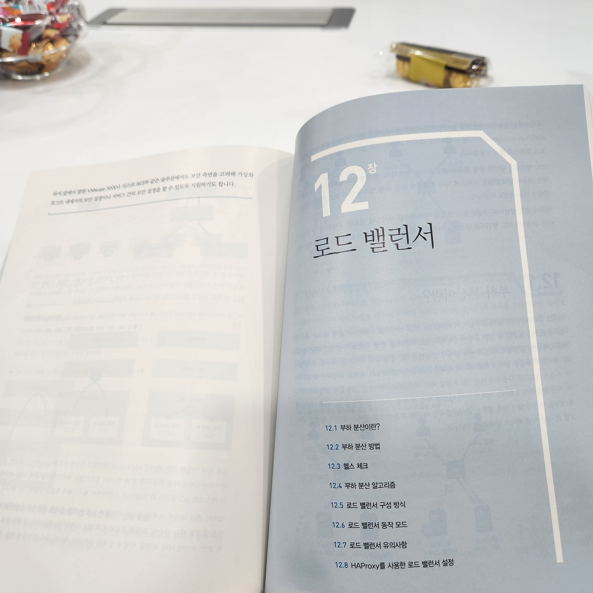
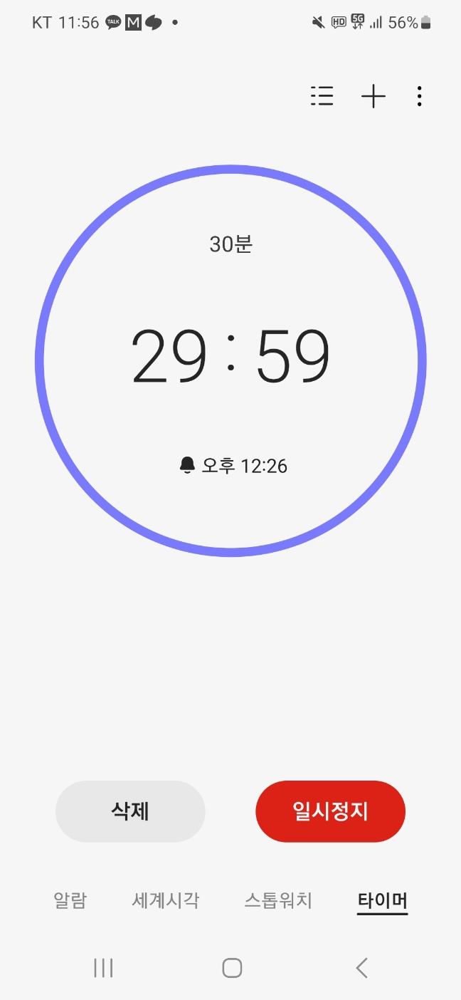
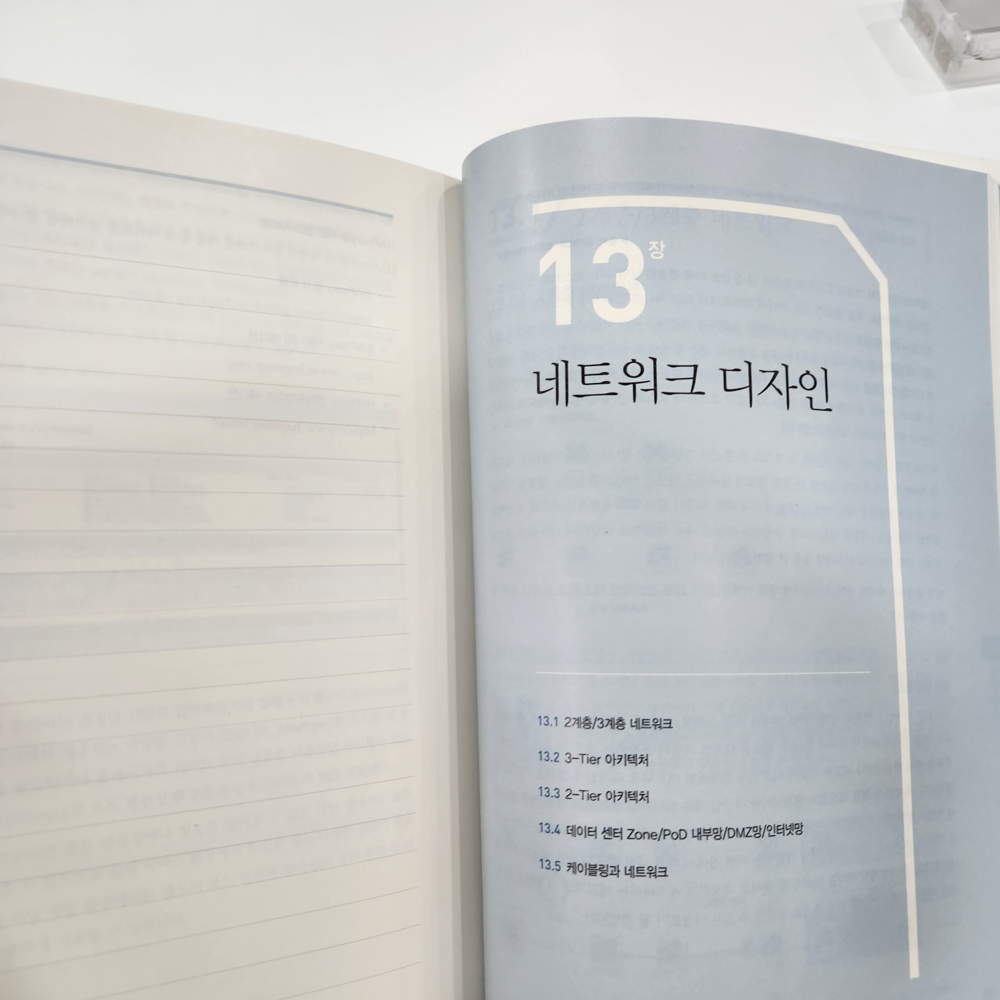

[어제][yesterday]에 이어서 11장 이중화 기술을 읽었습니다.

- 본딩은 여러 개의 네트워크를 합쳐서 하나의 네트워크로 합치는 기술입니다.
    - Linux, Windows 등에서의 본딩에 대해서 설명이 되어 있었는데, 이는 [어제][yesterday]

 

- MC-LAG
    - Peer 장비 : MC-LAG를 구성하는 장비
    - MC-LAG Domain : 두 Peer 장비를 하나의 논리 장비로 구성하기 위한영역 ID
    - Peer Link : MC-LAG를 구성하는 두 Peer 장비 간의 데이터 트래픽을 전송하는 인터링크

> 단, MC-LAG Domain은 표준용어가 아니며, 네트워크 장비(벤더사) 마다 그 이름이 다릅니다.

[yesterday]: ./2024-02-13_[11장]%20이중화%20기술.md