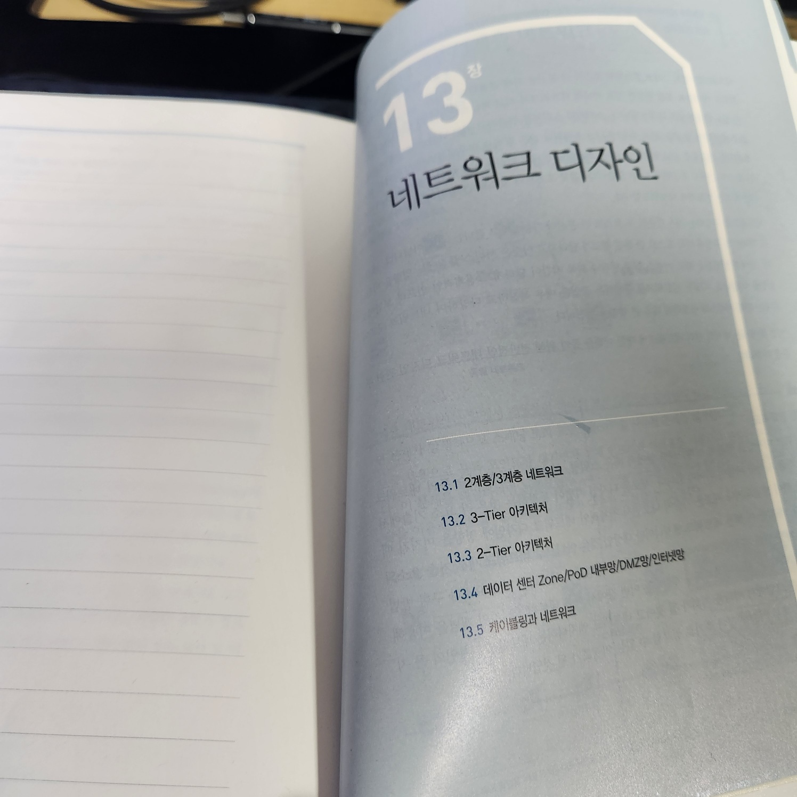
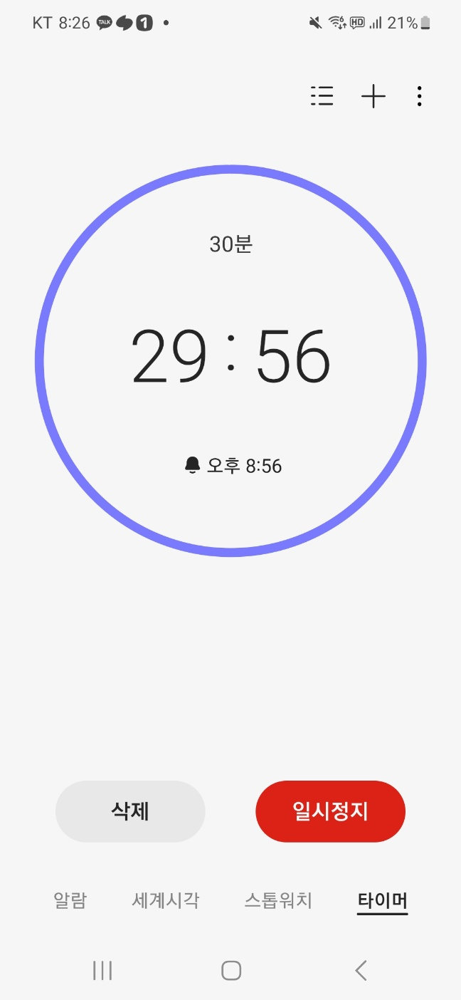
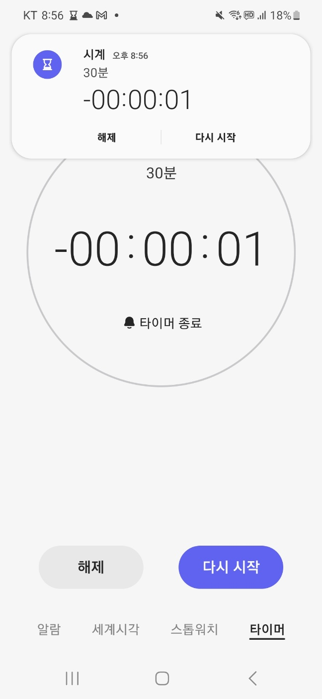
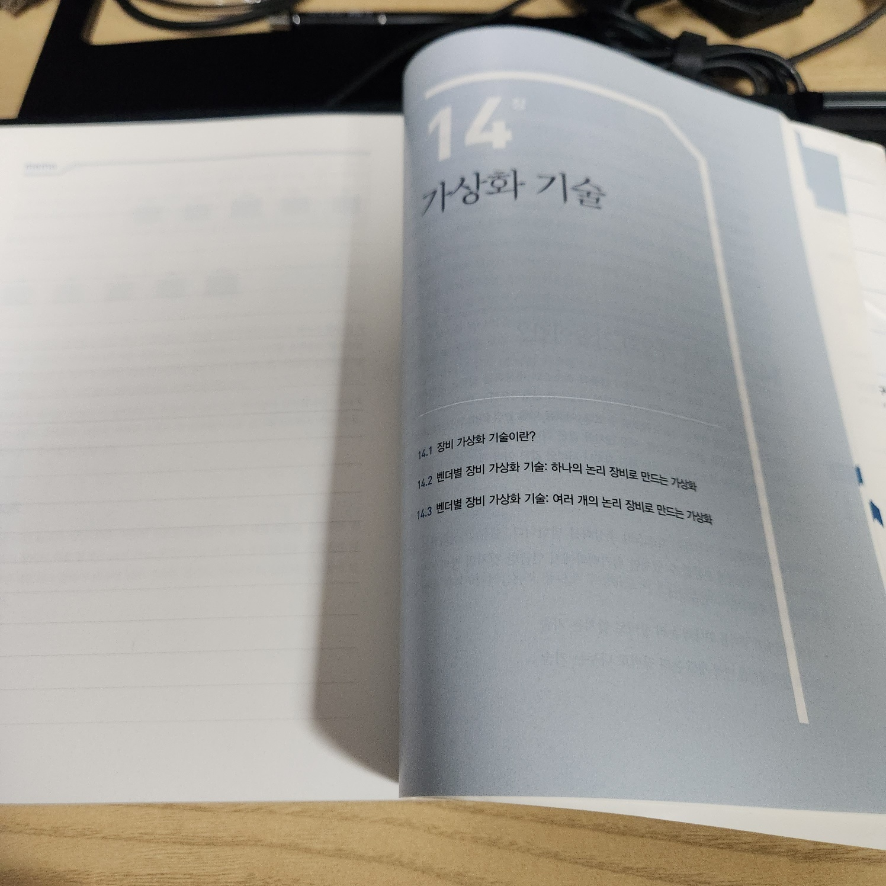
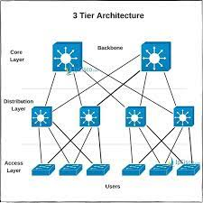

[어제][yesterday]에 이어서 13장 네트워크 디자인을 공부했습니다.

- `네트워크`는 정의 그대로 호스트와 호스트 간 통신을 위해 연결된 망이다.
    - 호스트와 호스트의 직접 연결
    - 하나의 스위치에 두 호스트 연결
    - 스위치와 스위치를 연결하고 서로 다른 스위치에 연결 된 호스트의 통신
- `네트워크 디자인과 구성`에 따라 호스트 간 통신 경로가 달라지고 이것은 서비스 품질에도 영향을 미칩니다.
- `네트워크 디자인과 구성`에 따라 장애 시 서비스 영향 범위나 회복 시간이 달라지고 전체적인 인프라 보안에도 영향을 끼칩니다.

## 2계층 네트워크

- 호스트 간 통신이 직접 2계층 통신 만으로만 이루어지는 것
- 따라서 브로드 캐스팅으로 인한 루프 현상이 발생할 수 있고, 한쪽 경로를 차단하는 스패닝 트리로 이를 해결이 가능하다. `블로킹 방식`
- 그러나 스패닝 트리를 적용하면 전체 대역폭을 쓸 수 없고 MC--LAG 기법 등을 사용해 루프를 제거하고 논 블로킹 방식을 구현할 수 있다. `논 블로킹 방식`

## 3계층 네트워크

- 호스트 간 통신이 IP 라우팅과 같은 3계층 통신으로 이루어지는 네트워크 디자인입니다.
- 라우팅으로 구성된 네트워크 구조이므로 루프 문제가 발생하지 않습니다.

## 3-Tier 아키텍처

- Core-Aggregation-Access 3계층으로 이루어진 아키텍처
    - 호스트와 직접 연결되는 Access 계층에 스위치 `최하위`
    - Access 스위치를 중간에서 접선하는 Aggregation 스위치
    - Core 계층 스위치는 Aggregation 스위치를 다시 모아 중간에서 접선 `최상위`
- `상위` 레이어로 올라갈수록 장비들이 접선되어 높은 대역폭 필요
    - 병목현상을 막기 위해, 각 레이어 상단과의 연결 구성인 `Uplink`에서는 `Oversubscription Ratio`를 잘 산정에 구성해야 합니다.

## 2-Tier 아키텍처

- Spine-leaf 구조로 네트워크 디자인을 하기도 함
    - L2 Febric, L3 Fabric으로 spine leaf의 각 연결 부분을 처리 가능
    - North-South Traffic이나 East-West Traffic으로 트렌드 변환이 이루어지고 있음

## 결론

[3-Tier 아키텍처](./2024-02-16_[13장]%20네트워크%20디자인.md#3-Tier아키텍처)와 [2-Tier 아키텍처](./2024-02-16_[13장]%20네트워크%20디자인.md#2-Tier아키텍처)를 보고 나서 기존에 "VPC 3-Tier로 네트워크 구성하였다"라고 말한 게 잘못된 내용이었나?라는 생각이 들었습니다. 이 부분은 모범 사례를 찾아봐야 할 것 같습니다.

이 외에는 인터넷망, 공인망(DMZ), 내부망(사내망/사설망), 데이터베이스망, 대외망, 관리망(OoB, Out of Band) 등의 개념적인 내용들이 많이 나왔습니다.

전체적으로 개념적인 내용이었고 [제로 트러스트 네트워크](https://www.aladin.co.kr/m/mproduct.aspx?ItemId=298090378)에서 어느 정도 배운 내용이라서 간단하게 넘겼습니다.

해당 실무를 하게 될 일이 없을 것 같이 느껴졌습니다.