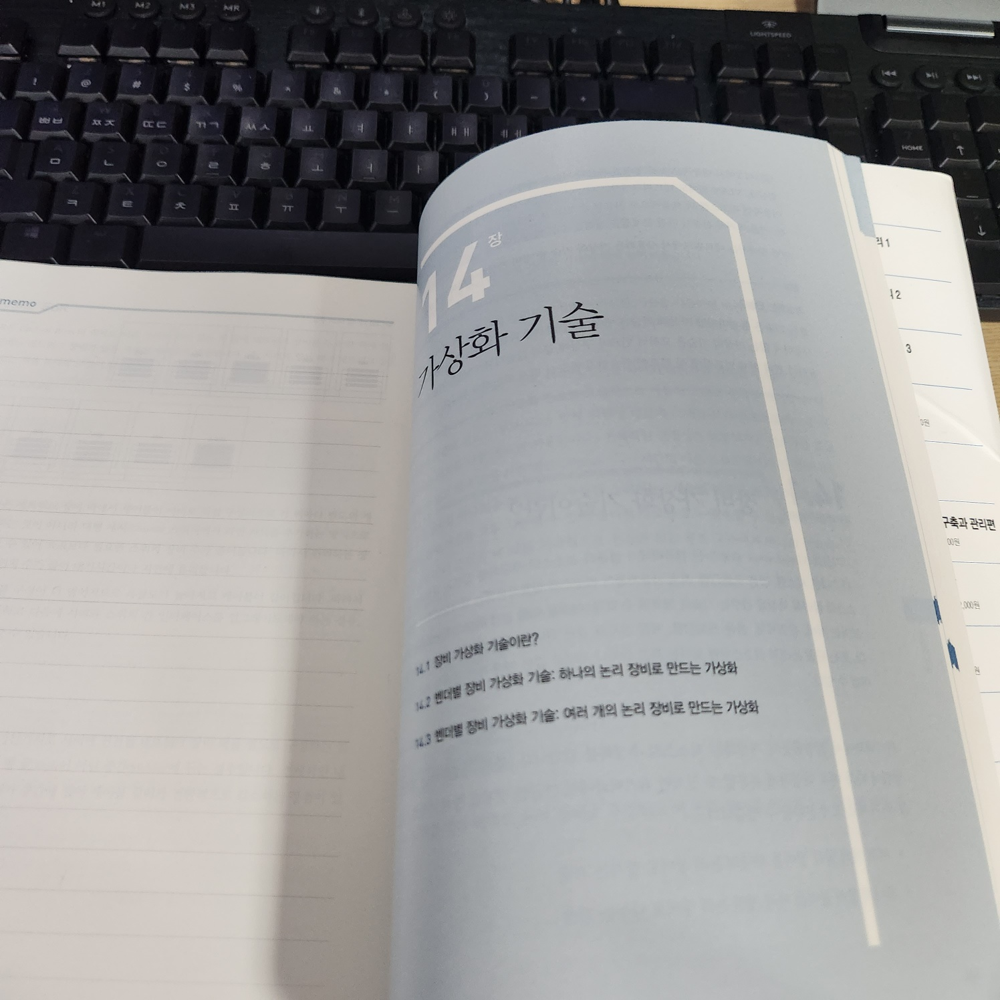
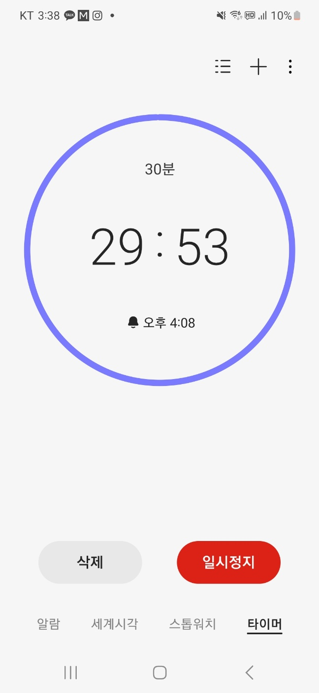
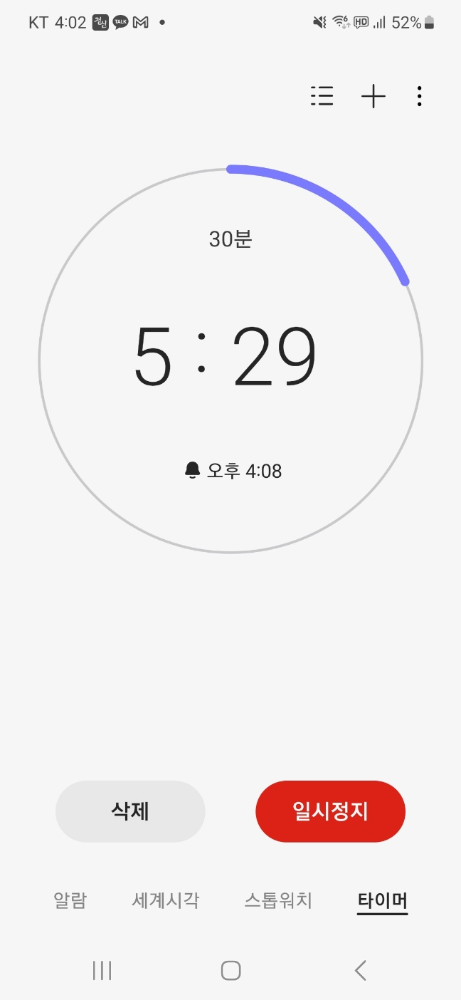
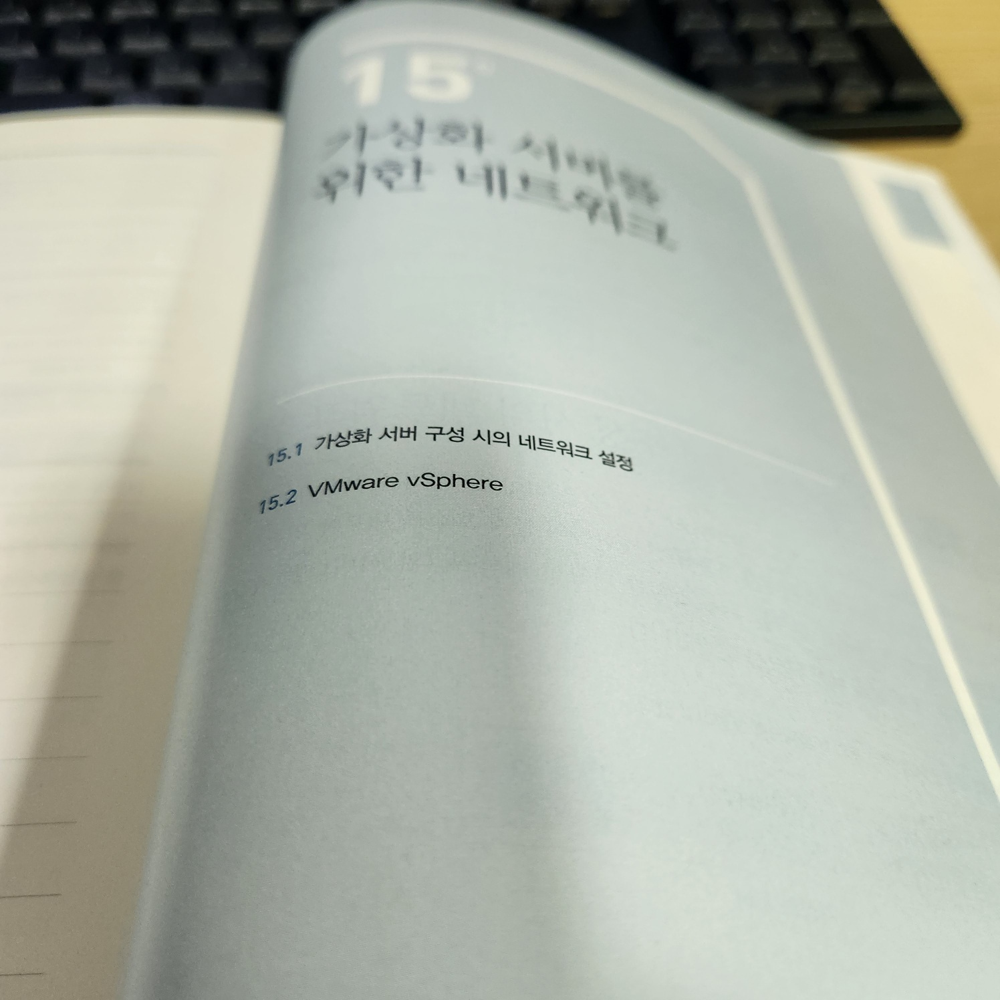

월간-CS를 시작하고 2월 3주차가 지나가고 있습니다.  

스터디는 2월 1일부터 시작이었지만, 1월 23일 부터 9일간 PoC 겸으로 공부를 시작했었습니다.  

9일 동안 이 책을 스터디 방식으로 진행하기에는 `책의 주제`를 비롯한 여러가지가 걸렸습니다.  

차라리 `빠르게 시작하고 빠르게 변화하자`라는 제 가치관 일단 시작하고 피드백을 받으면서 구체화하는 것이 좋아보였습니다.  

아무튼 2월 3주차가 2일 남은 시점에 14장, 15장만 남은게 조금 신기합니다.  

2월 4주차에는 새로운 마음으로 2회독을 하기 위해서 깔끔하게 하루에 한 챕터씩 읽으면 좋을 것 같습니다.  

## 가상화 기술

- 가상화 기술은 컴퓨터 리소스의 추상화를 일컫는 광범위한 용어

- 가상화는 다음과 같이 구분됩니다.
    - 여러 개의 물리 장비를 하나의 논리 장비로 합치는 기술
    - 하나의 물리 장비를 여러 개의 논리 장비로 나누느 기술

### 여러 대의 물리 장비 -> 하나의 논리 장비

- 장점
    1. 다수의 장비를 하나의 장비처럼 관리할 수 있어, 운영의 관리 부하 감소
    2. 이중화 경로를 효율적으로 사용하고 루프 문제를 제거할 수 있음
        -> 기존에 서버가 N대 일 때는, 2계층 스위치의 루프 현상을 막기 위해서 스패닝 트리를 사용해야 했다.
        -> 이 경우, 네트워크 대역폭을 온전히 쓸 수 없고 MG-LAG 등이 으로 해결할 수 있으나 전용 장비 요구사항이 있다.

- 총평 : 전체적인 안정성은 보장되지만 Failover 시의 복구 시간은 오래걸린다.

- 예시,
    - CISCO System's VSS, StackWise/FlexStack, FEX
    - Juniper : Virtual Chassis, VCF, Junos Fusion
    - Extreme
    - HP Enterprise(HP Networking)

### 하나의 물리 장비 -> 여러 개의 논리 장비

- 장점
    1. 운영 시 관리 포인트 감소 : 각 서비스 영역에 대해서는 개별적으로 동작하더라도 운영 면에서는 하나의 장비로 관리할 수 있어 관리 부하를 줄일 수 있다.
    2. 자원 활용률 증가 : 서버 가상화처럼 기존 유휴자원을 다른 영역에서 나누어 사용하게 함으로써 네트워크 장비의 자원을 효율적으로 사용 가능
    3. 도빙 비용과 누영 비용 절감(Capex & Opex) : 물리 장비 대신 논리 장비로 구성하면서 전체 장비 물량이 줄어들어 도입 비용 및 운영 비용이 절감

- 예시,
    - CISCO Systems
    - Citrix
    - F5
    - Fortinet