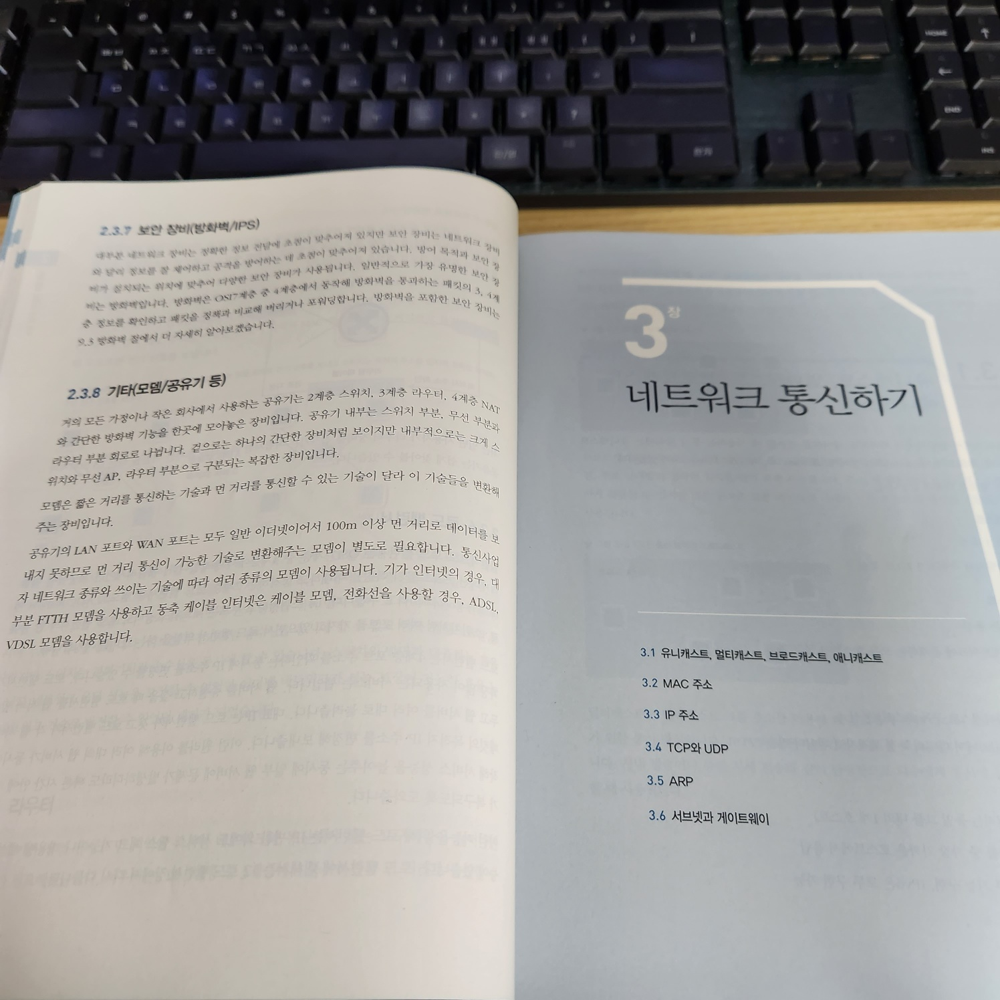
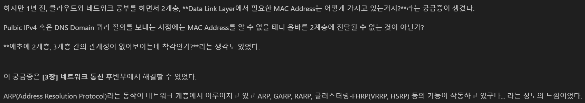

[어제](./2024-02-19_[1장][2회독]%20네트워크%20시작하기%20읽기.md) 1장을 읽었는데, 2회독을 할 만큼 와닿는 내용은 없었던 것 같습니다.

가장 감명 깊었던 3장에서 7장을 빡세게 읽는 것으로 전략을 바꿔서 공부했습니다.

[1월 15일](./2024-01-25_회고_[3장]%20네트워크%20통신하기.md)에 처음으로 이 책을 읽었을때, 아래와 같은 내용을 적었었다.

지금 다시보니까 진짜 얼토당토 안되는 내용을 회고라고 썻던 것 같다ㅋㅋㅋㅋ

HTTPS 통신은 DNS 질의 과정을 통한 여러 프로세스로 이루어진다.

이런 통신은 OSI 7 계층 중에서 3계층에 해당하는 IP를 이용해서 작동한다.

즉, `2계층까지 내려가지 않고 2계층, MAC Address의 ARP 과정`과는 전혀 관계가 없다.

 

MAC Address의 ARP 과정은 2계층 로컬 네트워크(wi-fi 등)에서 사용되는 방식이다.

책을 전체적으로 쭉 훑는 방식 덕분에 빠르게 `잘못된 지식(이해)`라는 것을 알게 되었다.

책을 빠르게 읽고 회독을 올리는 방식이 꽤 좋은 접근법이라고 느꼈다.