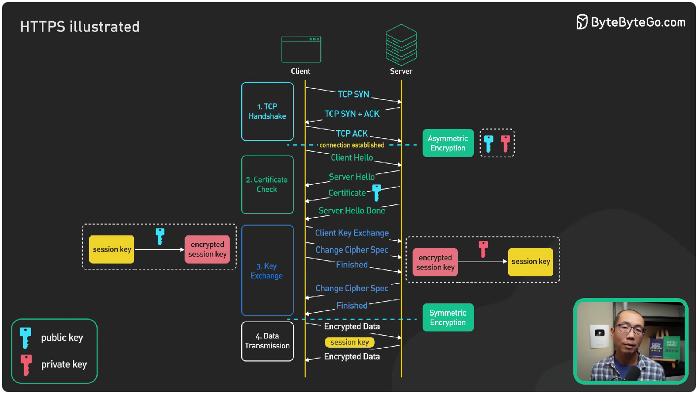

[5장 2회독](./2024-02-26_[5장][2회독]%20라우터%20L3%20스위치%203계층%20장비.md) 당시, 찾아두었던 블로그들의 회고를 읽으면서 2회독을 해보았다.

특히 4계층에서는 IP Address 기반의 통신을 이루고 있기 때문에, HTTP(S)나 FTP 기반의 프로토콜로 다양한 세션 장비의 설명을 하고 있다.

이 부분에 대해서 가상 면접 사례로 배우는 대규모 시스템 기초의 공동 저자인 Sahn Lam의 [SSL, TLS, HTTPS Explain](https://youtu.be/j9QmMEWmcfo?si=Z52Vx3yDvRcTajpe)을 먼저 듣고왔다.

크게 나누면 TCP Handshake / Certificate Check / Key Exchange / Data Transmission으로 구분되어 작동합니다.

이런 지식을 보면서 책을 보면, 로드밸런서 L4 와 L7이 약간 다를 것임을 추정할 수 있다.

즉, L4는 L5~7 계층에 접근하지 않으므로 L7 보다 효율적일 것입니다.

- [IT 엔지니어를 위한 네트워크 입문 - 6장 로드밸런서 / 방화벽: 4계층 장비(세션장비)](https://velog.io/@indongcha/IT-%EC%97%94%EC%A7%80%EB%8B%88%EC%96%B4%EB%A5%BC-%EC%9C%84%ED%95%9C-%EB%84%A4%ED%8A%B8%EC%9B%8C%ED%81%AC-%EC%9E%85%EB%AC%B8-6%EC%9E%A5-%EB%A1%9C%EB%93%9C%EB%B0%B8%EB%9F%B0%EC%84%9C-%EB%B0%A9%ED%99%94%EB%B2%BD-4%EA%B3%84%EC%B8%B5-%EC%9E%A5%EB%B9%84%EC%84%B8%EC%85%98%EC%9E%A5%EB%B9%84)
- [[Network] 6회차 스터디 - 로드 밸런서/방화벽: 4계층 장비(세션 장비)](https://gdsc-ajou.tistory.com/39)
- [6장: 로드밸런서/ 방화벽- 4계층 장비(세션장비)[IT 엔지니어를 위한 네트워크 입문 정리]](https://uung-dev.tistory.com/25)

이외 전체적으로는 프로토콜의 작동 방식에 대한 설명이었으나, 유투브 영상 하나 정도로 충분한 범위를 덮을 수 있어 보입니다!